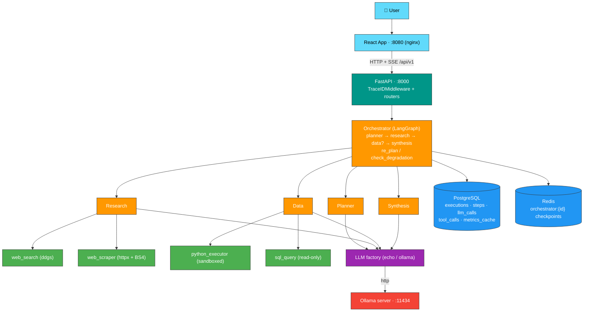

# Atlas Research System

[](https://github.com/sergiogg94/atlas_research_system/actions/workflows/ci.yml)
[](https://codecov.io/gh/sergiogg94/atlas_research_system)
[](https://www.python.org/)
[](LICENSE)

Multi-agent AI research platform: give it a complex task and it plans, researches, analyzes, and writes a final report.

Built from scratch on **FastAPI + LangGraph**: a task is decomposed into a plan by a Planner agent, investigated step-by-step on the web by a Research agent, analyzed with sandboxed Python/SQL by a Data agent, and synthesized into a structured report by a Synthesis agent — all orchestrated end-to-end, persisted in PostgreSQL, checkpointed in Redis, and streamed live to a React UI over SSE.

## Key features

- **End-to-end agent pipeline** — `POST /api/v1/execute-task` runs Planner → Research → (Data) → Synthesis through a single LangGraph `StateGraph`, with conditional routing (the Data agent only runs when the plan needs analysis) and a `re_plan` node that asks the LLM to `retry | skip | abort` failed agents.
- **Live progress via SSE** — the frontend subscribes to `/api/v1/tasks/{trace_id}/stream` (sse-starlette + `EventSource`) and receives step-by-step progress plus a final `complete` event with the report and metrics.
- **Observability with `trace_id`** — a middleware propagates a trace id through logs (colorlog), `llm_calls`, `tool_calls`, and `execution_steps`; per-execution metrics (latency, estimated tokens, error count) are computed and cached.
- **Safe tool execution** — Python code runs in a sandboxed subprocess (AST import allowlist, empty environment, memory/CPU `rlimits`); SQL is restricted to read-only `SELECT`/`WITH` queries with a keyword blacklist.
- **Self-reflection** — the Data agent analyzes its own execution errors (`reflect_error`) and retries up to 3 times; the orchestrator re-plans when an agent fails.
- **LLM provider abstraction** — a provider factory with retries (tenacity), defaulting to a deterministic `echo` provider for tests and a local **Ollama** provider for real runs.

## Architecture



Full system design, orchestrator control flow, execution sequence diagram, ER model and the decision log live in **[docs/ARCHITECTURE.md](docs/ARCHITECTURE.md)**.

## Tech stack

| Layer | Technology |
|---|---|
| Backend | Python 3.13 · FastAPI · Pydantic · async SQLAlchemy 2 + asyncpg · uvicorn |
| Orchestration | LangGraph (StateGraph + sub-graphs) · LangChain Core |
| Data | PostgreSQL 15 · Redis 7 (checkpoints) |
| LLM | Ollama (local) via provider factory + tenacity retries |
| Frontend | React 19 · Vite · TypeScript · TanStack Query · react-router |
| Real-time | SSE (sse-starlette) |
| Infra | Docker Compose · Nginx |
| Quality | pytest + pytest-asyncio · ruff · mypy · pre-commit · oxlint · vitest |

## Setup & usage

### Prerequisites

- [Docker](https://docs.docker.com/get-docker/) + Docker Compose (easiest path)
- or Python 3.13 with [uv](https://docs.astral.sh/uv/) and Node.js for local dev
- [Ollama](https://ollama.com/) running locally (optional but recommended, e.g. `ollama pull qwen2.5:7b`)

### 1. Configure environment

```sh
cp .env.example .env
```

Edit `.env` and fill in `POSTGRES_USER`, `POSTGRES_PASSWORD`, `DATABASE_URL` and `REDIS_URL` (the file has placeholders for those).

### 2a. Run with Docker Compose

```sh
docker compose up --build
```

- Backend API: http://localhost:8000 (OpenAPI docs at `/docs`)
- Frontend UI: http://localhost:8080

### 2b. Or run locally with uv

```sh
uv sync                                    # install Python deps
python backend/scripts/init_db.py         # create tables
uvicorn app.main:app --reload --port 8000 # run from backend/
```

```sh
cd frontend && npm install && npm run dev # frontend on :5173
```

> **Note:** `.env` is resolved relative to the project root — run uvicorn from `backend/` (see `docs/ARCHITECTURE.md` §10).

### 3. Try it

```sh
curl -X POST http://localhost:8000/api/v1/execute-task \
  -H "Content-Type: application/json" \
  -d '{"task_description": "Explain how transformers work and give 3 key applications"}'
```

Or use the UI to create the task and watch progress live on the detail page. Browse past executions at `GET /api/v1/tasks`, and aggregated stats at `GET /api/v1/stats`.

## Key technical decisions

| Decision | Summary | Details |
|---|---|---|
| Python sandboxing | Subprocess + AST allowlist + `rlimits` (256 MB, CPU) + empty env — chosen over Docker-per-run for zero infra | [ARCHITECTURE §4](docs/ARCHITECTURE.md#4-tools-layer), [§9 #1](docs/ARCHITECTURE.md#9-decision-log--tradeoffs) |
| Real-time updates | SSE over WebSocket — unidirectional progress, auto-reconnect, nginx-friendly | [ARCHITECTURE §9 #2](docs/ARCHITECTURE.md#9-decision-log--tradeoffs) |
| Checkpoints | Redis JSON snapshots (write-only today) — cheap, debuggable; LangGraph checkpointer considered for durable resume | [ARCHITECTURE §8](docs/ARCHITECTURE.md#8-redis-usage), [§9 #3](docs/ARCHITECTURE.md#9-decision-log--tradeoffs) |
| Execution model | Synchronous in-request `graph.ainvoke` (600s timeout); background queue (Celery/ARQ) as the scaling path | [ARCHITECTURE §9 #4](docs/ARCHITECTURE.md#9-decision-log--tradeoffs) |
| SQL safety | Static `SELECT`/`WITH`-only policy + keyword blacklist; dedicated read-only DB role as the hardening step | [ARCHITECTURE §4](docs/ARCHITECTURE.md#4-tools-layer) |
| Observability | Custom ContextVar tracing + full persistence of LLM/tool calls; no external APM | [ARCHITECTURE §7](docs/ARCHITECTURE.md#7-observability) |
| Metrics | Materialized `execution_metrics_cache` upserted on terminal states | [ARCHITECTURE §6](docs/ARCHITECTURE.md#6-data-model-postgresql) |

The full decision log with trade-offs, alternatives and future paths is in **[docs/ARCHITECTURE.md](docs/ARCHITECTURE.md#9-decision-log--tradeoffs)**.

## Documentation

- [docs/ARCHITECTURE.md](docs/ARCHITECTURE.md) — system design, sequence diagram, ER model, decision log
- [docs/api.md](docs/api.md) — full API reference (Swagger UI at `http://localhost:8000/docs`)
- [docs/orchestrator_graph.md](docs/orchestrator_graph.md) — orchestrator control flow (routing, re-planning, limits)
- [docs/planner_graph.md](docs/planner_graph.md) — Planner agent graph
- [docs/research_graph.md](docs/research_graph.md) — Research agent graph
- [docs/data_graph.md](docs/data_graph.md) — Data agent graph (incl. `reflect_error` loop)
- [docs/execution_db.md](docs/execution_db.md) — persistence schema and repository
- [docs/development_log.md](docs/development_log.md) — development notes

## Roadmap

- **Resume from checkpoints** — load `orchestrator:{id}` state to continue interrupted runs
- **Cost tracking** — real `estimated_cost_usd` based on provider pricing
- **Background execution** — decouple `graph.ainvoke` from the HTTP request (Celery/ARQ) and push updates over WebSocket
- **Token streaming** — stream LLM responses token-by-token to the UI
- **Hardened sandbox** — container-per-execution isolation and least-privilege DB role
- **Auth & multi-tenancy** — user accounts and per-tenant isolation

## License

GPL-3.0 — see [LICENSE](LICENSE).
