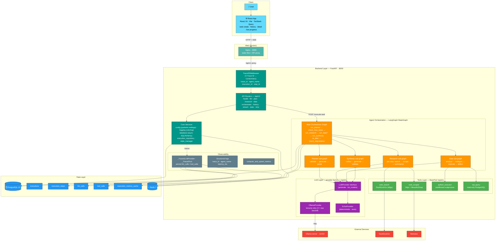
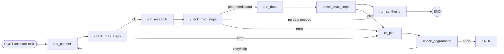
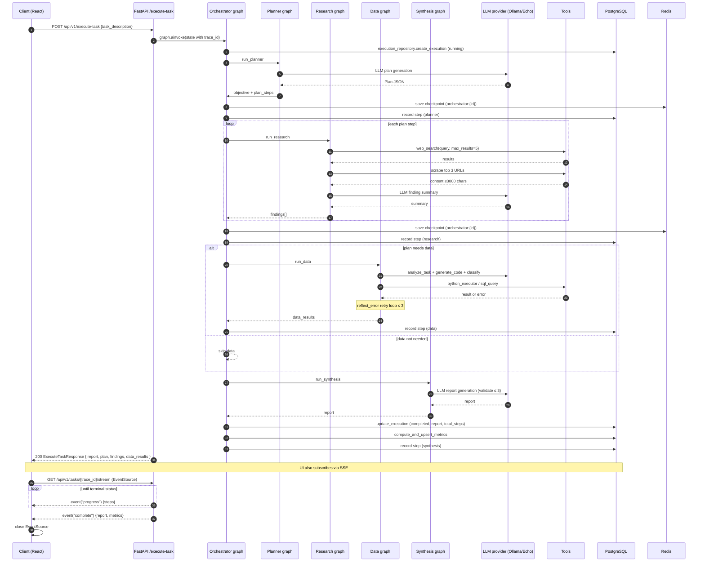
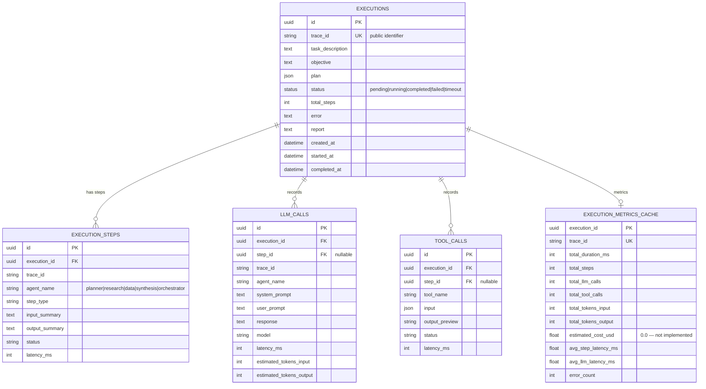

# Atlas Research System — Architecture

Multi-agent research system that receives a complex task, decomposes it into a plan, researches it on the web, performs data analysis, and synthesizes a final report. The backend is a **FastAPI** application orchestrating **LangGraph** agent graphs asynchronously, backed by **PostgreSQL** (persistence/history) and **Redis** (state checkpoints), with **Ollama** as the local LLM and a **React** frontend for task creation and live progress viewing.

## 1. System design

Note: the `TAB_*` tables, Redis, and the external services are the canonical deployments backing the components above.

### 1.1 API surface (OpenAPI at `/docs`)

All routes are under `/api/v1`:

| Method | Path | Purpose |
|---|---|---|
| `GET` | `/health` | Redis + PostgreSQL liveness probes |
| `POST` | `/test/generate` | LLM provider smoke test |
| `GET` | `/test/models` | List models from the provider |
| `POST` | `/plan` | Run Planner sub-graph standalone |
| `POST` | `/research` | Run Research sub-graph standalone |
| `POST` | `/data` | Run Data sub-graph standalone |
| `POST` | `/execute-task` | Full pipeline: Planner → Research → (Data) → Synthesis |
| `POST` | `/task/{trace_id}/retry` | Re-execute a task's description |
| `GET` | `/tasks` | List executions (pagination, status filter, search) |
| `GET` | `/tasks/{trace_id}` | Detail: report, steps, LLM & tool calls |
| `GET` | `/tasks/{trace_id}/metrics` | Cached metrics for the execution |
| `GET` | `/tasks/{trace_id}/stream` | SSE — live progress events |
| `GET` | `/stats` | Aggregated stats (success rate, avg duration…) |

## 2. Orchestration

### 2.1 Orchestrator graph (LangGraph `StateGraph`)

Every agent node flows through a `check_max_steps` gate; errors go to `re_plan`, which asks the LLM for `retry | skip | abort` and is bounded by `check_degradation` (3 consecutive failures on the same agent → abort).

- **State contract** (`OrchestratorState`): `task_description`, `objective`, `plan`, `plan_steps`, `research_findings`, `data_results`, `report`, `error`, `current_agent`, `step_index`, `total_steps`, `max_steps`, `checkpoint_idx`, `consecutive_failures`, `last_failure_agent`, `trace_id`, `execution_id`, `last_step_latency_ms`.
- **Hard limits**: `MAX_TOTAL_STEPS = 50` and `DEGRADATION_THRESHOLD = 3` (`backend/app/core/orchestrator.py`). Exceeding steps → status `TIMEOUT`; too many consecutive failures → `FAILED`.
- **Checkpoints**: after each agent node the sanitized state is written to Redis (`orchestrator:{id}` via `state_manager.save_orchestrator_state`), TTL 1 h. `run_planner` also creates the `executions` row in PG and every node records a step.
- **Timeouts**: `/execute-task` wraps `graph.ainvoke()` in `asyncio.wait_for(…, 600)` → HTTP 504 on timeout.

### 2.2 Agent sub-graphs

| Agent | Nodes (edges) | Iteration / guard |
|---|---|---|
| Planner | `validate → generate (LLM) → parse (Pydantic Plan)` | stops on validation/parse error |
| Research | `parse_step → web_search → scrape (top 3 URLs) → synthesize_finding (LLM)` per step | loops until steps exhausted |
| Data | `analyze → generate_code → classify (python/sql/both) → execute (python/sql) → reflect_error` | max 3 retries |
| Synthesis | `collect_results → generate (LLM) → validate` | max 3 attempts |

The orchestrator decides whether to launch the Data agent via a keyword heuristic on the plan steps (`_check_if_data_needed`); the Data agent itself decides which tool(s) to run based on LLM classification of the generated code.

## 3. Execution sequence — `POST /execute-task`

**Failure path**: each agent node marks the execution `failed`, records a failed step and metrics, and propagates `error` in state → `re_plan` LLM decision (`retry`/`skip`/`abort`); `abort` or `check_degradation` ends the run (still persisted for history).

## 4. Tools layer

Interface: `BaseTool` (`name`, `description`, `execute(**kwargs) → ToolResult`, `input_schema()`). Tools are registered in a global registry (`register_tool`/`get_tool`) and wrapped with `_TracedTool` (persists `tool_calls`).

| Tool | Implementation | Security |
|---|---|---|
| `web_search` | `ddgs` (DuckDuckGo), default `max_results=5` | query validation |
| `web_scraper` | httpx + BeautifulSoup, `max_chars=3000`; strips scripts/nav/footers | 15s timeout, strict URL |
| `python_executor` | subprocess + tempfile + empty env + rlimits | sandboxed (below) |
| `sql_query` | SQLAlchemy `text()` against async engine | read-only policy (below) |

### 4.1 Python sandbox (`python_executor`)

- **Static (AST)**: allowlisted imports (`pandas`, `numpy`, `matplotlib`, `json`, `math`, `statistics`, …); blocks `exec`, `eval`, `compile`, `__import__`, `open`, `os.*`, `subprocess.*`.
- **Runtime**: `subprocess.run` with `env={}`, `timeout=30s`, Linux `setrlimit` memory 256 MB, CPU time = timeout, no core dumps; temp file removed in `finally`; control-char sanitization.

### 4.2 SQL read-only policy (`sql_query`)

`SELECT` / `WITH … SELECT` only; no `;` (multi-statement), no comments, no shell meta-commands; keyword blacklist (`INSERT`, `UPDATE`, `DELETE`, `DROP`, `ALTER`, `PG_SLEEP`, `COPY…FROM PROGRAM`, …).

## 5. LLM provider layer

- `LLMProvider` interface: `generate(prompt, system)`, `list_models()`.
- Factory `get_llm_provider()` reads `llm_provider` from config (`echo` is default, `ollama` for real runs); `register_provider()` extends the registry.
- `OllamaProvider`: HTTP (`/api/generate`, `/api/tags`) with `tenacity` retry — 3 attempts, exponential 2–10 s, only on `httpx` timeouts/network errors.
- `EchoProvider`: deterministic echo for tests/dev.
- All providers are wrapped in `_TracedLLMProvider` which writes `llm_calls` rows (prompt preview, estimated tokens `len//4`, latency, error).

## 6. Data model (PostgreSQL)

Tables created via SQLAlchemy metadata (`backend/scripts/init_db.py`):

All reads/writes go through `execution_repository` (per-method `SessionLocal` sessions). Metrics are upserted (`on_conflict_do_update` on the PK) whenever the execution reaches a terminal state (`completed`/`failed`/`timeout`).

## 7. Observability

- **Trace ID**: `TraceIDMiddleware` reads `X-Trace-ID` (or generates one) and echoes it back in the response header; `ContextVar`s thread `trace_id`, `agent_name`, `execution_id`, `step_id` through async tasks.
- **Structured logs**: colorlog with those fields inline; `@trace_step` decorator reports agent latency (`last_step_latency_ms`).
- **Traced proxies**: every LLM call & tool call is persisted asynchronously (`asyncio.ensure_future`) — pipeline degrades gracefully if DB writes fail.
- **Metrics & stats**: `execution_metrics_cache` + `GET /stats`.

## 8. Redis usage

JSON snapshots with TTL 1 h under:

- `orchestrator:{id}` — full orchestrator state written after each agent node (`save_orchestrator_state`).
- `research:{id}` — `StateManager` exposes `save/get_research_state` for standalone research runs; not exercised by the current orchestration path.

`/health` performs `redis.ping()` and `SELECT 1` checks. **Write-only** checkpoints: no resume-from-checkpoint path exists (see §10).

## 9. Decision log & tradeoffs

| # | Area | Decision (chosen) | Why | Trade-offs / cost | Better-late alternatives |
|---|---|---|---|---|---|
| 1 | **Python sandbox** | Subprocess + AST allowlist + rlimits (256 MB, CPU, no core) + empty env + temp files | Zero infra, deterministic, fast, enough for a learning project | Not a containment boundary: escaped AST validation can reach host FS/network; no per-user quotas | Docker-per-run (volumes, GC), RestrictedPython, or OCI runtime with seccomp |
| 2 | **Live updates** | SSE (`sse-starlette` + `EventSource`) with 1s poll-and-push on change | Server→client only; auto-reconnect; nginx-friendly; no WebSocket state to manage | ≥1s latency; no client→server commands; still requires DB polling | WebSocket if bidirectional control (pause/cancel) or chat is needed |
| 3 | **Checkpoints** | Redis JSON snapshots (TTL 1h) | Reuses Redis, debuggable, zero new deps | Write-only today; no resume after restart/crash; snapshot cost on large states | LangGraph `checkpointer` (PostgresSaver) for durable replay + resume |
| 4 | **Execution model** | Synchronous in-request `graph.ainvoke` (600 s timeout) | Simplest model; easy debugging/test; single Docker process | Blocks a uvicorn worker; no horizontal scaling; client needs a long fetch timeout | Background workers (Celery/ARQ/RQ) + status polling |
| 5 | **LLM abstraction** | Interface + factory + registry (`echo` default) | Provider-agnostic; deterministic tests; config-driven | No streaming support; only Ollama/Echo shipped | Streaming `generate_stream`; OpenAI/Anthropic adapters |
| 6 | **LLM retries** | `tenacity` 3 attempts, exp backoff 2–10 s on network/timeout only | Bounded latency; avoids re-running prompts on persistent failures | HTTP 5xx not retried; no circuit breaker | Status-code-based retries with budgets |
| 7 | **SQL safety** | Static policy (SELECT/WITH + keyword blacklist) | Zero infra; enough for the demo | Regex ≠ parser; blacklist bypass risk; app DB user privileges | Dedicated read-only role + `pg_query`/sqlglot validation |
| 8 | **Observability** | ContextVars + traced proxies + full persistence (prompts, tokens) in PG | Complete audit trail w/o external services; easy SQL joins | Stores sensitive prompt text; DB-bound writes are fire-and-forget | OpenTelemetry export; run sinks; PII redaction |
| 9 | **Metrics** | Materialized `execution_metrics_cache` upsert on transitions | `/metrics`, `/stats` are instant | Stale between transitions; `estimated_cost_usd` = 0.0 | Streams/prom aggregates to a time series |
| 10 | **UI progress** | Hybrid: synchronous execute fetch + SSE detail page | Both worlds: simple create, live progress on detail | Progress only visible on detail page; execute itself is 10-min fetch | Full WS-driven execute page; incremental report streaming |
| 11 | **Standalone agent endpoints** | `/plan`, `/research`, `/data` reuse sub-graphs | Demos, isolated debugging, tests | Those runs aren't persisted/traced | Unify behind a single facade with an execution id |

## 10. Known limitations & next steps

- Redis checkpoints are write-only — no in-flight resume.
- `estimated_cost_usd` is hardcoded `0.0`.
- SQL safety is heuristic; DB role isn't least-privilege.
- Python sandbox is process-level, not a container boundary (tradeoff #1).
- `/task/{trace_id}/retry` starts a new execution instead of reusing the original trace.
- No auth, no multi-tenancy, CORS `*`.
- No token streaming from the LLM layer (only full responses).
- `.env` path resolution requires running from `backend/` (see AGENTS.md quirks).
