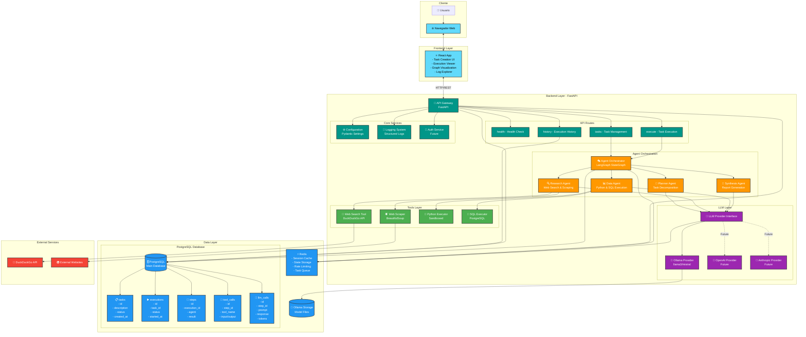

# System arqutecture

```mermaid
graph TB
    subgraph "Cliente"
        USER[👤 Usuario]
        BROWSER[🌐 Navegador Web]
    end

    subgraph "Frontend Layer"
        REACT[⚛️ React App<br/>- Task Creation UI<br/>- Execution Viewer<br/>- Graph Visualization<br/>- Log Explorer]
    end

    subgraph "Backend Layer - FastAPI"
        API[🚀 API Gateway<br/>FastAPI]
        
        subgraph "API Routes"
            HEALTH[health - Health Check]
            TASKS[tasks - Task Management]
            EXEC[execute - Task Execution]
            HISTORY[history - Execution History]
        end

        subgraph "Core Services"
            CONFIG[⚙️ Configuration<br/>Pydantic Settings]
            LOGGING[📝 Logging System<br/>Structured Logs]
            AUTH[🔐 Auth Service<br/>Future]
        end

        subgraph "Agent Orchestration"
            ORCHESTRATOR[🎭 Agent Orchestrator<br/>LangGraph StateGraph]
            
            PLANNER[🧠 Planner Agent<br/>Task Decomposition]
            RESEARCH[🔍 Research Agent<br/>Web Search & Scraping]
            DATA[📊 Data Agent<br/>Python & SQL Execution]
            SYNTHESIS[📄 Synthesis Agent<br/>Report Generation]
        end

        subgraph "Tools Layer"
            WEBSEARCH[🔎 Web Search Tool<br/>DuckDuckGo API]
            SCRAPER[🕷️ Web Scraper<br/>BeautifulSoup]
            PYEXEC[🐍 Python Executor<br/>Sandboxed]
            SQLEXEC[💾 SQL Executor<br/>PostgreSQL]
        end

        subgraph "LLM Layer"
            LLMPROVIDER[🤖 LLM Provider Interface]
            OLLAMA[🦙 Ollama Provider<br/>llama3/mistral]
            OPENAI[🔮 OpenAI Provider<br/>Future]
            ANTHROPIC[🎯 Anthropic Provider<br/>Future]
        end
    end

    subgraph "Data Layer"
        subgraph "PostgreSQL Database"
            DB[(🗄️ PostgreSQL<br/>Main Database)]
            
            TASKS_TABLE[📋 tasks<br/>- id<br/>- description<br/>- status<br/>- created_at]
            
            EXEC_TABLE[▶️ executions<br/>- id<br/>- task_id<br/>- status<br/>- started_at]
            
            STEPS_TABLE[👣 steps<br/>- id<br/>- execution_id<br/>- agent<br/>- result]
            
            TOOLS_TABLE[🔧 tool_calls<br/>- id<br/>- step_id<br/>- tool_name<br/>- input/output]
            
            LLM_TABLE[💬 llm_calls<br/>- id<br/>- step_id<br/>- prompt<br/>- response<br/>- tokens]
        end

        REDIS[⚡ Redis<br/>- Session Cache<br/>- State Storage<br/>- Rate Limiting<br/>- Task Queue]
        
        OLLAMADB[(🦙 Ollama Storage<br/>Model Files)]
    end

    subgraph "External Services"
        DUCKDUCK[🦆 DuckDuckGo API]
        WEBSITES[🌍 External Websites]
    end

    %% User Flow
    USER --> BROWSER
    BROWSER <--> REACT
    REACT <-->|HTTP/REST| API

    %% API to Routes
    API --> HEALTH
    API --> TASKS
    API --> EXEC
    API --> HISTORY

    %% Routes to Services
    TASKS --> ORCHESTRATOR
    EXEC --> ORCHESTRATOR
    HISTORY --> DB

    %% Core Services
    API --> CONFIG
    API --> LOGGING
    API --> AUTH

    %% Orchestration Flow
    ORCHESTRATOR --> PLANNER
    ORCHESTRATOR --> RESEARCH
    ORCHESTRATOR --> DATA
    ORCHESTRATOR --> SYNTHESIS

    %% Agents to Tools
    RESEARCH --> WEBSEARCH
    RESEARCH --> SCRAPER
    DATA --> PYEXEC
    DATA --> SQLEXEC

    %% Agents to LLM
    PLANNER --> LLMPROVIDER
    RESEARCH --> LLMPROVIDER
    DATA --> LLMPROVIDER
    SYNTHESIS --> LLMPROVIDER

    %% LLM Providers
    LLMPROVIDER --> OLLAMA
    LLMPROVIDER -.->|Future| OPENAI
    LLMPROVIDER -.->|Future| ANTHROPIC

    %% Database Connections
    API --> DB
    ORCHESTRATOR --> DB
    DB --> TASKS_TABLE
    DB --> EXEC_TABLE
    DB --> STEPS_TABLE
    DB --> TOOLS_TABLE
    DB --> LLM_TABLE

    %% Redis Connections
    API --> REDIS
    ORCHESTRATOR --> REDIS
    LLMPROVIDER --> REDIS

    %% Ollama
    OLLAMA --> OLLAMADB

    %% External Connections
    WEBSEARCH --> DUCKDUCK
    SCRAPER --> WEBSITES

    %% Styling
    classDef frontend fill:#61dafb,stroke:#333,stroke-width:2px,color:#000
    classDef backend fill:#009688,stroke:#333,stroke-width:2px,color:#fff
    classDef agent fill:#ff9800,stroke:#333,stroke-width:2px,color:#fff
    classDef tool fill:#4caf50,stroke:#333,stroke-width:2px,color:#fff
    classDef llm fill:#9c27b0,stroke:#333,stroke-width:2px,color:#fff
    classDef data fill:#2196f3,stroke:#333,stroke-width:2px,color:#fff
    classDef external fill:#f44336,stroke:#333,stroke-width:2px,color:#fff

    class REACT,BROWSER frontend
    class API,CONFIG,LOGGING,AUTH,HEALTH,TASKS,EXEC,HISTORY backend
    class ORCHESTRATOR,PLANNER,RESEARCH,DATA,SYNTHESIS agent
    class WEBSEARCH,SCRAPER,PYEXEC,SQLEXEC tool
    class LLMPROVIDER,OLLAMA,OPENAI,ANTHROPIC llm
    class DB,REDIS,TASKS_TABLE,EXEC_TABLE,STEPS_TABLE,TOOLS_TABLE,LLM_TABLE,OLLAMADB data
    class DUCKDUCK,WEBSITES external
```