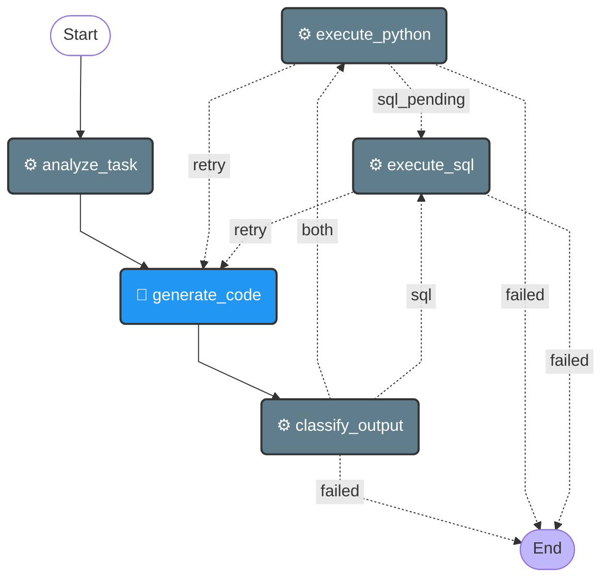

# Data Agent

**Source**: `app/core/agents/data.py`

## State

| Field | Type |
|-------|------|
| `task` | `str` |
| `context` | `str` |
| `code` | `Optional[str]` |
| `query` | `Optional[str]` |
| `execution_result` | `Optional[dict]` |
| `error` | `Optional[str]` |
| `iteration` | `int` |
| `analysis` | `Optional[str]` |
| `trace_id` | `str` |

## Flow Diagram

## Nodes

| Node | Function | Type | Description |
|------|----------|------|-------------|
| `analyze_task` | `analyze_task()` | default | Decides which tool to use for the task. |
| `generate_code` | `generate_code()` | llm | Generates Python or SQL code based on the analysis. |
| `classify_output` | `classify_output()` | default | Classifies generated code as Python, SQL, or both, and splits if needed. |
| `execute_python` | `execute_python()` | default | Execute the generated Python code. |
| `execute_sql` | `execute_sql()` | default | Execute the generated SQL query. |

## Edges

| From | To | Condition | Type |
|------|----|-----------|------|
| `START` | `analyze_task` | `—` | direct |
| `analyze_task` | `generate_code` | `—` | direct |
| `classify_output` | `END` | `failed` | conditional |
| `classify_output` | `execute_python` | `both` | conditional |
| `classify_output` | `execute_sql` | `sql` | conditional |
| `execute_python` | `END` | `failed` | conditional |
| `execute_python` | `execute_sql` | `sql_pending` | conditional |
| `execute_python` | `generate_code` | `retry` | conditional |
| `execute_sql` | `END` | `failed` | conditional |
| `execute_sql` | `generate_code` | `retry` | conditional |
| `generate_code` | `classify_output` | `—` | direct |
