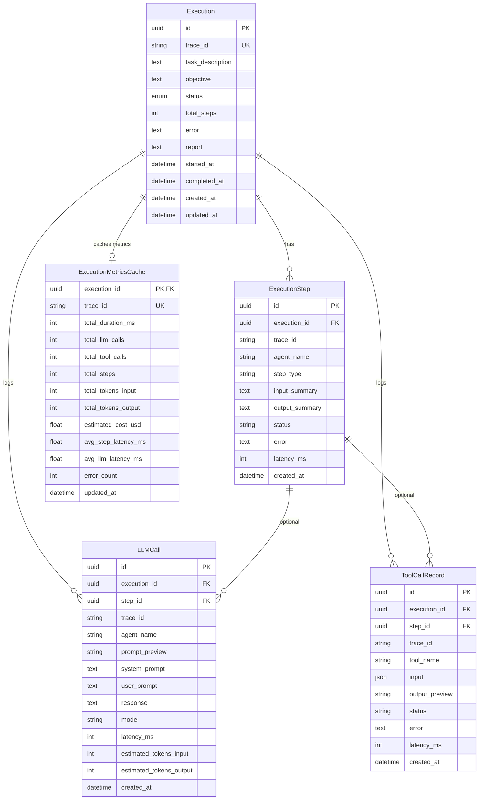

# Execution Database

**Source**: `backend/app/models/execution.py`

## Entity-Relationship Diagram

## Tables

### Execution

Main table representing a complete multi-agent system execution.

| Column | Type | Constraints | Description |
|--------|------|-------------|-------------|
| `id` | `UUID` | `PK`, `default=uuid4` | Unique identifier |
| `trace_id` | `String(36)` | `UK`, `NOT NULL`, `index` | External traceability ID |
| `task_description` | `Text` | `NOT NULL` | Task description |
| `objective` | `Text` | `nullable` | High-level objective |
| `status` | `Enum(ExecutionStatus)` | `default=pending`, `index` | Current state (`pending`, `running`, `completed`, `failed`, `timeout`) |
| `total_steps` | `Integer` | `default=0` | Total number of steps |
| `error` | `Text` | `nullable` | Error message if failed |
| `report` | `Text` | `nullable` | Final generated report |
| `started_at` | `DateTime` | `nullable` | Execution start time |
| `completed_at` | `DateTime` | `nullable` | Execution end time |
| `created_at` | `DateTime` | `default=datetime.now` | Creation timestamp |
| `updated_at` | `DateTime` | `default=now`, `onupdate=now` | Last modification timestamp |

### ExecutionStep

Each atomic step or action within an execution (e.g., a LangGraph node).

| Column | Type | Constraints | Description |
|--------|------|-------------|-------------|
| `id` | `UUID` | `PK`, `default=uuid4` | Unique identifier |
| `execution_id` | `UUID` | `FK → executions.id`, `ON DELETE CASCADE`, `NOT NULL`, `index` | Parent execution |
| `trace_id` | `String(36)` | `NOT NULL`, `index` | Traceability ID |
| `agent_name` | `String(50)` | `NOT NULL` | Agent that executed the step |
| `step_type` | `String(50)` | `nullable` | Step type (e.g., `plan`, `research`, `synthesis`) |
| `input_summary` | `Text` | `nullable` | Step input summary |
| `output_summary` | `Text` | `nullable` | Step output summary |
| `status` | `String(20)` | `default=completed` | Step status |
| `error` | `Text` | `nullable` | Error if any occurred |
| `latency_ms` | `Integer` | `nullable` | Step duration in milliseconds |
| `created_at` | `DateTime` | `default=datetime.now` | Creation timestamp |

### ExecutionMetricsCache

Aggregated metrics cache per execution for fast queries without scanning child tables.

| Column | Type | Constraints | Description |
|--------|------|-------------|-------------|
| `execution_id` | `UUID` | `PK`, `FK → executions.id`, `ON DELETE CASCADE` | Associated execution |
| `trace_id` | `String(36)` | `UK`, `NOT NULL`, `index` | Traceability ID |
| `total_duration_ms` | `Integer` | `nullable` | Total duration |
| `total_llm_calls` | `Integer` | `default=0` | Total LLM calls |
| `total_tool_calls` | `Integer` | `default=0` | Total tool calls |
| `total_steps` | `Integer` | `default=0` | Total steps |
| `total_tokens_input` | `Integer` | `default=0` | Total input tokens |
| `total_tokens_output` | `Integer` | `default=0` | Total output tokens |
| `estimated_cost_usd` | `Float` | `default=0.0` | Estimated cost in USD |
| `avg_step_latency_ms` | `Float` | `nullable` | Average step latency |
| `avg_llm_latency_ms` | `Float` | `nullable` | Average LLM call latency |
| `error_count` | `Integer` | `default=0` | Number of errors |
| `updated_at` | `DateTime` | `default=now`, `onupdate=now` | Last update timestamp |

### LLMCall

Detailed record of each language model call within a step.

| Column | Type | Constraints | Description |
|--------|------|-------------|-------------|
| `id` | `UUID` | `PK`, `default=uuid4` | Unique identifier |
| `execution_id` | `UUID` | `FK → executions.id`, `ON DELETE CASCADE`, `NOT NULL`, `index` | Parent execution |
| `step_id` | `UUID` | `FK → execution_steps.id`, `ON DELETE SET NULL`, `nullable` | Associated step (optional) |
| `trace_id` | `String(36)` | `NOT NULL`, `index` | Traceability ID |
| `agent_name` | `String(50)` | `NOT NULL` | Agent that made the call |
| `prompt_preview` | `String(500)` | `nullable` | Prompt preview |
| `system_prompt` | `Text` | `nullable` | Full system prompt |
| `user_prompt` | `Text` | `nullable` | Full user prompt |
| `response` | `Text` | `nullable` | Model response |
| `model` | `String(100)` | `nullable` | Model used (e.g., `llama3`, `gpt-4`) |
| `latency_ms` | `Integer` | `nullable` | Call latency |
| `estimated_tokens_input` | `Integer` | `nullable` | Estimated input tokens |
| `estimated_tokens_output` | `Integer` | `nullable` | Estimated output tokens |
| `created_at` | `DateTime` | `default=datetime.now` | Creation timestamp |

### ToolCallRecord

Detailed record of each tool invocation (web search, Python executor, etc.).

| Column | Type | Constraints | Description |
|--------|------|-------------|-------------|
| `id` | `UUID` | `PK`, `default=uuid4` | Unique identifier |
| `execution_id` | `UUID` | `FK → executions.id`, `ON DELETE CASCADE`, `NOT NULL`, `index` | Parent execution |
| `step_id` | `UUID` | `FK → execution_steps.id`, `ON DELETE SET NULL`, `nullable` | Associated step (optional) |
| `trace_id` | `String(36)` | `NOT NULL`, `index` | Traceability ID |
| `tool_name` | `String(100)` | `NOT NULL` | Tool name |
| `input` | `JSON` | `nullable` | Full tool input |
| `output_preview` | `String(500)` | `nullable` | Output preview |
| `status` | `String(20)` | `default=success` | Status (`success`, `error`, `timeout`) |
| `error` | `Text` | `nullable` | Error message if any |
| `latency_ms` | `Integer` | `nullable` | Call duration |
| `created_at` | `DateTime` | `default=datetime.now` | Creation timestamp |

## Indexes

| Table | Column(s) | Type |
|-------|-----------|------|
| `executions` | `trace_id` | Unique |
| `executions` | `status` | Simple |
| `execution_steps` | `execution_id` | Simple |
| `execution_steps` | `trace_id` | Simple |
| `execution_metrics_cache` | `trace_id` | Unique |
| `llm_calls` | `execution_id` | Simple |
| `llm_calls` | `trace_id` | Simple |
| `tool_calls` | `execution_id` | Simple |
| `tool_calls` | `trace_id` | Simple |

## Relationships

| Child table | Parent table | FK column | `ON DELETE` behavior | Cardinality |
|-------------|-------------|-----------|----------------------|-------------|
| `execution_steps` | `executions` | `execution_id` | `CASCADE` | 1 Execution → * Steps |
| `execution_metrics_cache` | `executions` | `execution_id` | `CASCADE` | 1 Execution → 1 MetricsCache |
| `llm_calls` | `executions` | `execution_id` | `CASCADE` | 1 Execution → * LLMCalls |
| `llm_calls` | `execution_steps` | `step_id` | `SET NULL` | 0..1 Step → * LLMCalls |
| `tool_calls` | `executions` | `execution_id` | `CASCADE` | 1 Execution → * ToolCalls |
| `tool_calls` | `execution_steps` | `step_id` | `SET NULL` | 0..1 Step → * ToolCalls |

## Notes

- **trace_id** is a unique 36-character alphanumeric identifier that correlates the same execution across all tables, useful for external traceability.
- **ExecutionStatus** is an enum with values: `pending`, `running`, `completed`, `failed`, `timeout`.
- `LLMCall` and `ToolCallRecord` have `step_id` nullable with `ON DELETE SET NULL`, preserving historical records even if the associated step is deleted.
- `ExecutionMetricsCache` uses `execution_id` as its PK, establishing a 1:1 relationship with `Execution`.
