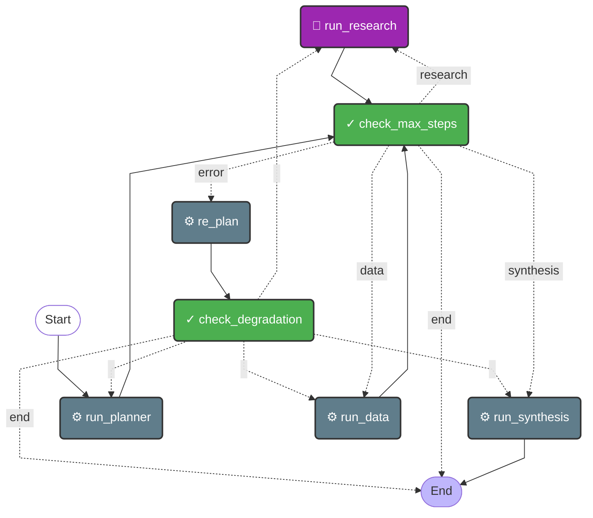

# Orchestrator Agent

**Source**: `app/core/agents/orchestrator.py`

## State

| Field | Type |
|-------|------|
| `task_description` | `str` |
| `objective` | `str` |
| `plan` | `Optional[dict]` |
| `plan_steps` | `Optional[list]` |
| `research_findings` | `Optional[list]` |
| `data_results` | `Optional[list]` |
| `report` | `Optional[str]` |
| `error` | `Optional[str]` |
| `current_agent` | `str` |
| `step_index` | `int` |
| `total_steps` | `int` |
| `max_steps` | `int` |
| `checkpoint_idx` | `Optional[str]` |
| `consecutive_failures` | `int` |
| `last_failure_agent` | `Optional[str]` |

## Flow Diagram

## Nodes

| Node | Function | Type | Description |
|------|----------|------|-------------|
| `run_planner` | `run_planner()` | default | Invoke the Planner Agent to break down the task. |
| `run_research` | `run_research()` | tool | *No description* |
| `run_data` | `run_data()` | default | *No description* |
| `run_synthesis` | `run_synthesis()` | default | *No description* |
| `re_plan` | `re_plan()` | default | If an agent failed, try to re-plan with the LLM. |
| `check_max_steps` | `check_max_steps()` | validation | Prevents infinite loops by stopping at MAX_TOTAL_STEPS. |
| `check_degradation` | `check_degradation()` | validation | Detects degradation: abort after multiple consecutive failures on the same agent. |

## Edges

| From | To | Condition | Type |
|------|----|-----------|------|
| `START` | `run_planner` | `—` | direct |
| `check_degradation` | `END` | `end` | conditional |
| `check_degradation` | `run_data` | `—` | conditional |
| `check_degradation` | `run_planner` | `—` | conditional |
| `check_degradation` | `run_research` | `—` | conditional |
| `check_degradation` | `run_synthesis` | `—` | conditional |
| `check_max_steps` | `END` | `end` | conditional |
| `check_max_steps` | `re_plan` | `error` | conditional |
| `check_max_steps` | `run_data` | `data` | conditional |
| `check_max_steps` | `run_research` | `research` | conditional |
| `check_max_steps` | `run_synthesis` | `synthesis` | conditional |
| `re_plan` | `check_degradation` | `—` | direct |
| `run_data` | `check_max_steps` | `—` | direct |
| `run_planner` | `check_max_steps` | `—` | direct |
| `run_research` | `check_max_steps` | `—` | direct |
| `run_synthesis` | `END` | `—` | direct |
