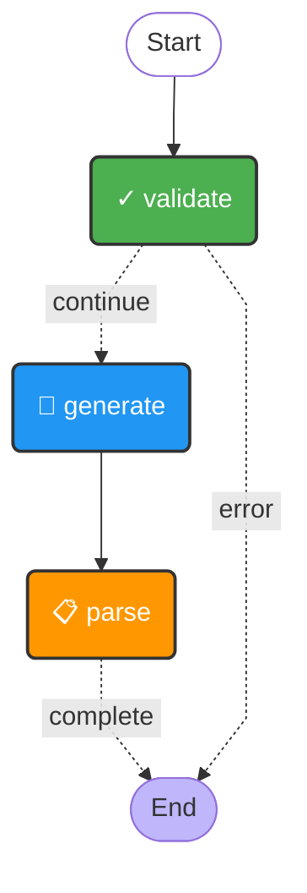

# Planner Agent

**Source**: `app/core/agents/planner.py`

## State

| Field | Type |
|-------|------|
| `task_description` | `str` |
| `plan` | `Optional[Plan]` |
| `error` | `Optional[str]` |
| `llm_response` | `Optional[str]` |

## Flow Diagram

## Nodes

| Node | Function | Type | Description |
|------|----------|------|-------------|
| `validate` | `validate_task()` | validation | Validate that the task description is not empty. |
| `generate` | `generate_plan()` | llm | Call the LLM to generate a plan. |
| `parse` | `parse_plan()` | parse | Parse and validate the LLM response into a Plan. |

## Edges

| From | To | Condition | Type |
|------|----|-----------|------|
| `START` | `validate` | `—` | direct |
| `generate` | `parse` | `—` | direct |
| `parse` | `END` | `complete` | conditional |
| `validate` | `END` | `error` | conditional |
| `validate` | `generate` | `continue` | conditional |
