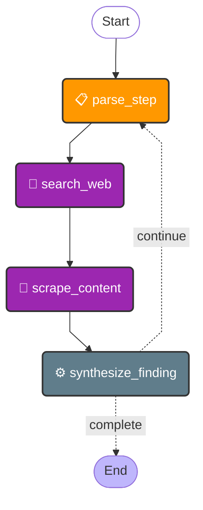

# Research Agent

**Source**: `app/core/agents/research.py`

## State

| Field | Type |
|-------|------|
| `objective` | `str` |
| `steps` | `list` |
| `current_step` | `int` |
| `findings` | `list` |
| `error` | `Optional[str]` |
| `current_query` | `Optional[str]` |
| `search_results` | `Optional[list]` |
| `scraped_contents` | `Optional[list]` |

## Flow Diagram

## Nodes

| Node | Function | Type | Description |
|------|----------|------|-------------|
| `parse_step` | `parse_step()` | parse | Defines the current query based on the current step and objective. |
| `search_web` | `search_web()` | tool | Executes a web search. |
| `scrape_content` | `scrape_content()` | tool | Scrapes content from the search results. |
| `synthesize_finding` | `synthesize_finding()` | default | Sinthesizes the findings into a summary for the current step. |

## Edges

| From | To | Condition | Type |
|------|----|-----------|------|
| `START` | `parse_step` | `—` | direct |
| `parse_step` | `search_web` | `—` | direct |
| `scrape_content` | `synthesize_finding` | `—` | direct |
| `search_web` | `scrape_content` | `—` | direct |
| `synthesize_finding` | `END` | `complete` | conditional |
| `synthesize_finding` | `parse_step` | `continue` | conditional |
